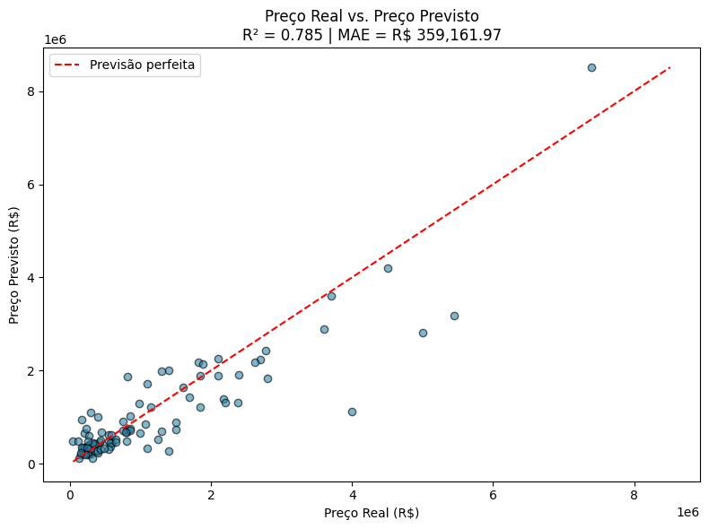
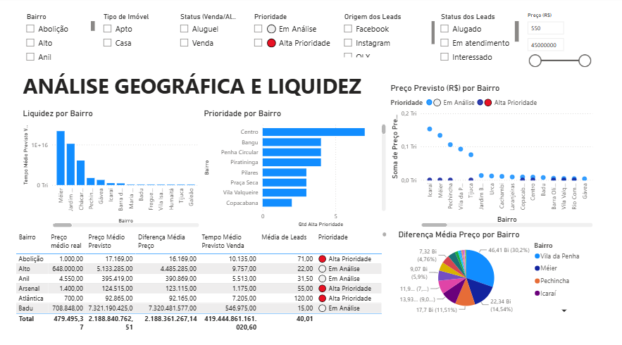

# 🏠 TCC – Predição de Preços de Imóveis com k-NN Regressor

Projeto de Machine Learning para prever o preço de imóveis com base em suas características, complementado por um dashboard de Business Intelligence com análise geográfica e priorização de leads.

##  Problema e Objetivo

Definir o preço de um imóvel de forma justa e competitiva é um desafio para corretores e imobiliárias, que muitas vezes dependem apenas da experiência pessoal para precificar. Este projeto usa Machine Learning para estimar o preço de venda/aluguel de um imóvel a partir de suas características (área, quartos, banheiros, vagas, bairro etc.), e vai além: cruza essas previsões com dados de leads para apoiar decisões de priorização e liquidez por região.

##  Tecnologias Utilizadas

- **Python**
- **Pandas** e **NumPy** – manipulação e tratamento de dados
- **Scikit-learn** – `LabelEncoder`, `StandardScaler`, `train_test_split`, `KNeighborsRegressor`
- **Matplotlib** – visualização de resultados
- **Power BI** – dashboard interativo de análise

##  Sobre o Dataset

O dataset contém características de imóveis (área, quartos, banheiros, vagas, bairro, entre outras) usadas para treinar o modelo de previsão de preço.

##  Pipeline do Modelo

1. **Carregamento e preparação dos dados**
2. **Codificação de variáveis categóricas** com `LabelEncoder`
3. **Divisão treino/teste** com `train_test_split`
4. **Normalização** dos dados com `StandardScaler`
5. **Escolha do melhor k** para o `KNeighborsRegressor`
6. **Treinamento do modelo** com `k=2` e `weights='distance'`
7. **Avaliação** com R² e MAE
8. **Previsão** de preço para novos imóveis

## 📈 Resultados

| Métrica | Resultado |
|---|---|
| R² (Coeficiente de Determinação) | **0,785** |
| MAE (Erro Absoluto Médio) | **R$ 359.161,97** |



##  Exemplo de Previsão

Para um apartamento na Tijuca, com 85 m², 2 quartos, 2 banheiros e 1 vaga, o modelo estimou:

> **Preço previsto: R$ 461.609,44**

##  Dashboard (Power BI)

Além do modelo preditivo, o projeto conta com um dashboard em Power BI que cruza as previsões de preço com dados de leads, permitindo:

- Análise de liquidez e tempo médio de venda por bairro
- Priorização de imóveis com maior potencial (alta prioridade)
- Comparação entre preço real e preço previsto por região
- Filtros por bairro, tipo de imóvel, status (venda/aluguel), prioridade e origem/status dos leads



O arquivo completo do dashboard está disponível em [`dashboard/dashboard-imoveis-knn-r.pbix`](dashboard/dashboard-imoveis-knn-r.pbix).

## 📁 Estrutura do Projeto
tcc-imoveis-knn-r/
│
├── data/
│ └── dados_imoveis_knn-r.csv
│
├── notebooks/
│ └── previsao_imoveis_knn.ipynb
│
├── src/
│ └── tcc_knn_r.py
│
├── dashboard/
│ └── dashboard-imoveis-knn-r.pbix
│
├── images/
│ ├── resultados-modelo.png
│ └── dashboard.png
│
├── README.md
├── requirements.txt
└── .gitignore


##  Como Executar

```bash
# Clone o repositório
git clone https://github.com/danielsantiago92/tcc-imoveis-knn-r.git
cd tcc-imoveis-knn-r

# Instale as dependências
pip install -r requirements.txt

# Execute o notebook
jupyter notebook notebooks/previsao_imoveis_knn.ipynb
```

##  Próximos Passos

- Testar outros algoritmos de regressão para comparação (Random Forest, XGBoost)
- Incluir mais variáveis no modelo (ex: proximidade de transporte público, IPTU)
- Publicar o dashboard no Power BI Service para acesso via navegador

##  Autor

Daniel Santiago
